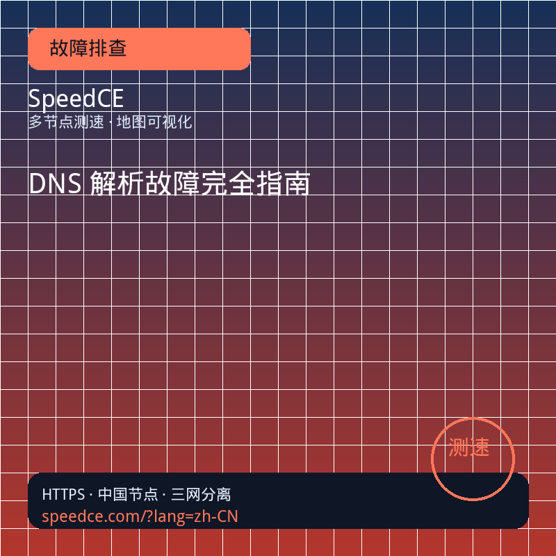
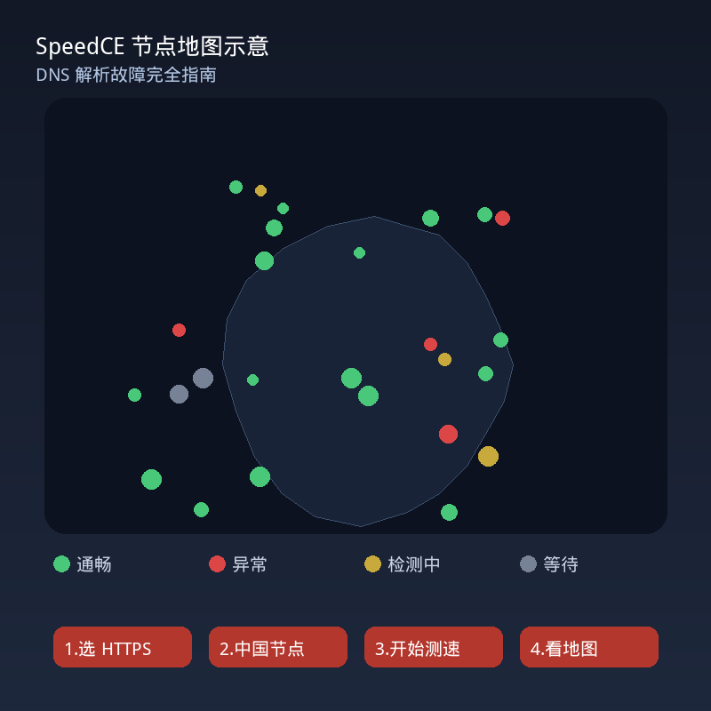

# SpeedCE CSDN 高质量长文库

> 目标规格：每篇 **8000–15000 字** 级实战长文，对标 CSDN「高质量推荐」标准

> 工具：https://www.speedce.com | 中文：https://speedce.com/?lang=zh-CN

**库内文章**：212 篇（已发布 2 + 生成长文 210）  
**生成长文平均字数**：约 16138 字符/篇  
**配图**：每篇 2 张正方形图（封面 + 地图示意），各提供 800×800 与 500×500 两种尺寸

## 文章配图（210 篇 × 2 张）

| 图片 | 用途 | 路径 |
|------|------|------|
| 封面图 | CSDN 文章头图 / 封面 | `images/{slug}/cover-800.png` 或 `cover-500.png` |
| 示意图 | 正文插图（节点地图 + 四步流程） | `images/{slug}/diagram-800.png` 或 `diagram-500.png` |

- 完整清单：`images/manifest.json`
- 重新生成：`python3 scripts/generate_article_images.py`
- 8 大类别配色：故障排查(红)、VPS(蓝)、CDN(紫)、出海(青)、行业(绿)、方法论(靛)、对比(金)、进阶(蓝绿)

**CSDN 发布示例**（在正文开头插入）：

```markdown

...

```

## 已发布（CSDN 高质量推荐）

| 标题 | 链接 |
|------|------|
| 网站慢、打不开、部分用户访问异常？站长多节点测速实战手册（SpeedCE 实操版） | https://blog.csdn.net/weixin_72303315/article/details/162210031 |
| 2026 在线网站测速工具横评：ITDOG、BOCE、17CE、SpeedCE 等 10 款主流平台深度对比 | https://blog.csdn.net/weixin_72303315/article/details/162210199 |

## 手工精品（优先发布）

| 文件 | 标题 | 类别 |
|------|------|------|
| `vps-line-verification-guide.md` | 买 VPS 前必看：用全国三网地图验线路，识破 CN2 / 精品网宣传（SpeedCE 实操） | VPS线路 |
| `cdn-deployment-speed-test-guide.md` | CDN 接入全攻略：切量前、切量中、故障时，多节点测速验收怎么做 | CDN |
| `global-deployment-checklist.md` | 网站出海测速验收手册：从中国节点到全球节点的完整检查流程 | 出海 |

## 生成长文索引（按类别）

### CDN（23 篇）

| 文件 | 标题 | 字数 |
|------|------|------|
| `aliyun-cdn-acceptance.md` | 阿里云 CDN 接入验收完全指南：回源、证书、预热与三网 | 16274 |
| `aws-cloudfront-china.md` | AWS CloudFront 中国访问：全球分发与国内体验双验收 | 16332 |
| `bunny-cdn-guide.md` | Bunny CDN 性价比线路：全球节点地图验收 | 16258 |
| `cdn-cache-vs-speed-test.md` | CDN 缓存与拨测的关系：为什么第一次慢、刷新后又快 | 16211 |
| `cdn-cert-vs-origin.md` | CDN 证书与源站证书：两边都要绿的完整验收流程 | 16195 |
| `cdn-cutover-72h.md` | CDN 切量 72 小时监控手册：从 T+0 到 T+72 每小时做什么 | 16285 |
| `cdn-deployment-speed-test-guide.md` | CDN 接入全攻略：切量前、切量中、故障时，多节点测速验收怎么做 | 16169 |
| `cdn-origin-failure.md` | CDN 回源失败完全排查：边缘节点、超时与源站对照 | 16211 |
| `cdn-websocket-stream.md` | CDN 加速 WebSocket/直播流的可达性验收边界 | 16445 |
| `cloudflare-china-access.md` | Cloudflare 橙云开启后国内访问完整验收手册 | 16418 |
| `dcdn-vs-cdn.md` | 全站加速 DCDN 与普通 CDN：验收标准与 SpeedCE 对照测法 | 16301 |
| `edge-function-troubleshoot.md` | 边缘函数/Workers 故障：主域绿、规则不生效的排查 | 16269 |
| `fastly-cdn-guide.md` | Fastly CDN 验收：边缘规则与源站对照测速 | 16230 |
| `font-cdn-google-china.md` | 字体 CDN 与 Google Fonts：国内加载失败的测速分工 | 16362 |
| `free-cdn-enough.md` | 免费 CDN 够用吗：用全国地图数据做个人站决策 | 16187 |
| `huawei-baidu-cdn-guide.md` | 华为云/百度云 CDN 验收要点与三网地图标准 | 16370 |
| `image-cdn-webp-avif.md` | 图片 CDN 与 WebP/AVIF：静态域全国验收 | 16306 |
| `multi-cdn-comparison.md` | 多家 CDN 试用期地图对比选型：同域不同商的科学方法 | 16272 |
| `overseas-cdn-china-pack.md` | 海外 CDN 中国加速包验收：全球绿、国内慢时怎么办 | 16243 |
| `qiniu-cdn-guide.md` | 七牛云 CDN 接入：国内站长常用方案的测速验收 | 16178 |
| `static-cdn-split.md` | 静态资源 CDN 分离验收：js/css 域与主站的独立测速清单 | 16232 |
| `tencent-cdn-acceptance.md` | 腾讯云 CDN 接入验收：静态加速与全站加速差异及测速要点 | 16217 |
| `upyun-cdn-guide.md` | 又拍云 CDN 验收：图片站与静态加速地图标准 | 16181 |

### VPS线路（29 篇）

| 文件 | 标题 | 字数 |
|------|------|------|
| `aws-lightsail-china.md` | AWS Lightsail 对国内访问：全球绿、中国慢的常见形态 | 16290 |
| `bandwagonhost-guide.md` | 搬瓦工 CN2/GIA 套餐验机：经典商家地图验收法 | 16239 |
| `bare-metal-dedicated-line.md` | 物理机专线接入：企业专线用户的地图验收 | 16076 |
| `bgp-line-verification.md` | BGP 线路真假辨别：三网均衡才是真 BGP 的验收标准 | 16138 |
| `budget-vps-trap-guide.md` | 超低价 VPS 陷阱：地图验收能看出的 6 个危险信号 | 16101 |
| `cloud-security-group-vps.md` | 云服务器到手第一步：安全组与防火墙验收再谈线路 | 16134 |
| `cmi-mobile-line-guide.md` | 移动优化 CMI 线路验收：移动用户占比过半时代的一票否决项 | 16169 |
| `cn2-gt-vs-gia.md` | CN2 GT 与 CN2 GIA 完全对比：商家话术背后的测速验证法 | 16316 |
| `colocation-vs-cloud.md` | 托管机房 vs 公有云：同一业务选型后的地图验收差异 | 16147 |
| `datacenter-failover-verify.md` | 机房故障换机后应急验证：24 小时 SpeedCE 点检 SOP | 16128 |
| `dedicated-vs-vps-line.md` | 独立服务器与 VPS 线路验收差异：IP 段、邻居与测速注意点 | 16236 |
| `europe-vps-china-guide.md` | 欧洲 VPS 回国线路验收：德法荷机房对国内用户的真实体验 | 16165 |
| `gcp-azure-china-access.md` | GCP / Azure 回国访问：企业云对国内团队的地图评估 | 16233 |
| `home-broadband-vs-datacenter.md` | 家宽测速 vs 全国节点：为什么你 Ping 快不代表用户快 | 16182 |
| `hong-kong-vps-guide.md` | 香港 VPS 线路选购与验收完全手册：个人站、电商、API 场景怎么选 | 16352 |
| `japan-vps-guide.md` | 日本 VPS 适合什么业务：东京大阪机房与三网回国实测验收 | 16184 |
| `korea-vps-guide.md` | 韩国 VPS 线路测评：离中国近不等于三网都好 | 16118 |
| `off-peak-vs-peak-vps.md` | VPS 下午测与晚高峰测：为什么优质线路必须测两次 | 16150 |
| `oracle-cloud-free.md` | 甲骨文云免费 tier 验收：零成本机器的地图标准 | 16203 |
| `ping-blocked-not-bad.md` | 禁 Ping 不等于线路差：PING 红 HTTPS 绿的正确解读与验机调整 | 16213 |
| `racknerd-dmit-guide.md` | RackNerd / DMIT 等热门商家：退款期地图验机模板 | 16318 |
| `singapore-vps-guide.md` | 新加坡 VPS 验收指南：东南亚枢纽与回国双视角测速 | 16161 |
| `taiwan-vps-guide.md` | 台湾 VPS 验收要点：延迟优势与线路宣传核实 | 16103 |
| `us-vps-china-access.md` | 美国 VPS 三网回国测评完全手册：西海岸机房怎么验、移动用户怎么办 | 16311 |
| `used-ip-segment-check.md` | 二手 IP 段购买前避雷：被墙、被标记 IP 的全国地图特征 | 16166 |
| `vps-line-verification-guide.md` | 买 VPS 前必看：用全国三网地图验线路，识破 CN2 / 精品网宣传（SpeedCE 实操） | 16223 |
| `vps-refund-period-checklist.md` | VPS 7 天退款期验机完全清单：截图、三网、晚高峰证据链 | 16224 |
| `vps-with-cdn-comparison.md` | VPS 套 CDN 前后地图对比：该不该上 CDN 的数据决策 | 16212 |
| `vultr-line-guide.md` | Vultr 各机房线路验收：按业务选东京/新加坡/洛杉矶 | 16184 |

### 出海（22 篇）

| 文件 | 标题 | 字数 |
|------|------|------|
| `api-rate-limit-global.md` | 全球 API 限流与 Geo 封禁：地图绿但仍 403 的边界 | 16238 |
| `app-store-review-server.md` | App Store 审核期间服务器：海外审核节点可达性 | 16240 |
| `china-blocked-overseas-ok.md` | 全球绿、中国红：被墙/合规问题的标准判断流程 | 16078 |
| `cross-border-ecommerce.md` | 外贸独立站测速完全指南：Shopify/WooCommerce 与大促前验收 | 16157 |
| `cross-border-sale-prep.md` | 跨境电商黑五/圣诞大促前测速备战完全清单 | 16273 |
| `dual-site-cn-com.md` | 双站点 .cn 与 .com 策略：分域名测速与合规分工 | 16235 |
| `europe-us-slow-fix.md` | 欧美用户访问慢完全对策：源站、CDN、机房选址三角决策 | 16144 |
| `game-server-global.md` | 游戏出海服务器选址：玩家分布与全球 PING 地图对照 | 16113 |
| `gdpr-cookie-wall.md` | GDPR 与 Cookie 墙：欧洲用户访问的网络层基线 | 16206 |
| `geodns-verification.md` | GeoDNS 智能解析验证：各地解析到不同 IP 的测速方法 | 16179 |
| `global-deployment-checklist.md` | 网站出海测速验收手册：从中国节点到全球节点的完整检查流程 | 16134 |
| `global-team-china-admin.md` | 全球团队访问国内后台：双地图协作与加速方案选型 | 16125 |
| `latin-america-nodes.md` | 拉美节点验收：巴西、墨西哥重点市场地图标准 | 16062 |
| `middle-east-africa-nodes.md` | 中东与非洲节点验收：新兴市场的地图达标策略 | 16107 |
| `multilingual-site-delivery.md` | 多语言站点全球分发：hreflang 与各地可达性验收 | 16115 |
| `notion-saas-availability.md` | Notion 类协作工具自托管：全球团队访问验收 | 16203 |
| `overseas-live-streaming.md` | 海外直播与视频会议节点选型：延迟敏感业务的地图标准 | 16173 |
| `saas-global-launch.md` | 出海 SaaS 全球上线验收：目标市场通畅率达标完全手册 | 16192 |
| `shopify-speedtest.md` | Shopify 店铺全球可达性：主题、支付与应用域的分层测速 | 16212 |
| `southeast-asia-nodes.md` | 东南亚市场节点验收手册：新马泰印尼菲逐国达标线 | 16140 |
| `stripe-payment-domain-check.md` | 出海支付域名校验：支付页、回调 URL 的独立测速 | 16100 |
| `woocommerce-global.md` | WooCommerce 出海验收：插件、支付网关与主域地图清单 | 16238 |

### 对比（15 篇）

| 文件 | 标题 | 字数 |
|------|------|------|
| `17ce-vs-speedce.md` | 17CE vs SpeedCE：老牌表格派与新锐地图派实战对比 | 16079 |
| `aliyun-boce-vs-speedce.md` | 阿里云云拨测 vs SpeedCE：同云用户如何搭配 | 16105 |
| `cesu-vs-speedce.md` | CESU.ai vs SpeedCE：新兴工具站与地图派实测对比 | 16128 |
| `chinaz-toolkit-review.md` | 站长之家工具生态 vs SpeedCE：Ping/测速/Whois 分工 | 16148 |
| `developer-bookmark-list.md` | 开发者 2026 检测书签栏：12 个链接应对 90% 网络故障 | 16066 |
| `gtmetrix-vs-speedce.md` | GTmetrix vs SpeedCE：性能测试与网络拨测分工 | 16142 |
| `map-vs-table-tools.md` | 地图派 vs 表格派测速工具：排障效率的实测对比 | 16051 |
| `monitoring-vs-probing.md` | 监控平台 vs 拨测工具：7×24 告警与第一现场的关系 | 16021 |
| `pagespeed-vs-network.md` | PageSpeed Insights 与网络拨测：站长必须弄清的分工边界 | 16219 |
| `ping-pe-use-cases.md` | Ping.pe 完全使用手册：与 SpeedCE 的全球/中国互补策略 | 16074 |
| `speedce-vs-boce.md` | SpeedCE vs BOCE 完全对比：轻量地图与全能运维的边界 | 16161 |
| `speedce-vs-itdog.md` | SpeedCE vs ITDOG 完全对比：场景、优缺点与搭配策略 | 16176 |
| `top5-free-speedtest-2026.md` | 2026 个人站长免费测速 TOP5 深度评测与收藏建议 | 16275 |
| `vsping-vs-speedce.md` | VSPING vs SpeedCE：污染检测与网络可达性的配合 | 16113 |
| `webpagetest-vs-speedce.md` | WebPageTest vs SpeedCE：何时用哪个 | 16186 |

### 故障排查（38 篇）

| 文件 | 标题 | 字数 |
|------|------|------|
| `502-503-upstream-errors.md` | 502/503 与源站过载：CDN 绿、源站红时的判断与修复路径 | 16336 |
| `api-availability-guide.md` | API 接口可达性检测指南：Postman 能通、全国用户不通的真相 | 16312 |
| `cache-poisoning-stale.md` | 缓存脏了怎么办：CDN/浏览器缓存与网络层对照排查 | 16173 |
| `cors-vs-network-testing.md` | CORS 报错与网络不通：开发者必分的两层问题 | 16290 |
| `database-not-network-guide.md` | 数据库拖垮网站：网络全绿但页面超时的应用层排查 | 16155 |
| `ddos-attack-detection.md` | 被攻击期间如何用多节点测速辅助判断影响面 | 16333 |
| `dns-propagation-slow.md` | 域名解析生效慢怎么判断：TTL、运营商缓存与区域 DNS 差异 | 16263 |
| `dns-troubleshooting-guide.md` | DNS 解析故障完全指南：迁机、换 CDN 后「部分地区打不开」怎么查 | 16327 |
| `docker-port-mapping.md` | Docker 端口映射错误：容器内正常、全国用户打不开的验收 | 16231 |
| `email-link-tracking.md` | 邮件内链接追踪域：营销邮件点击失败的网络排查 | 16139 |
| `firewall-security-group-checklist.md` | 云服务器安全组验收：全国地图大面积红时先查这四项 | 16245 |
| `grpc-gateway-check.md` | gRPC / HTTP2 网关：REST 可达与 gRPC 故障分工 | 16269 |
| `gzip-brotli-compression.md` | 压缩配置与超时：大响应体导致的「能通但极慢」 | 16132 |
| `http-https-redirect-issues.md` | HTTP 与 HTTPS 跳转故障：强制跳转、循环重定向、混合内容排查 | 16382 |
| `intermittent-fault-diagnosis.md` | 间歇性网站故障排查：「有时慢有时好」的科学点检方法 | 16213 |
| `ipv6-troubleshooting.md` | IPv6 双栈站点验收：AAAA 记录、防火墙与 CDN 的完整检查 | 16240 |
| `k8s-ingress-troubleshoot.md` | Kubernetes Ingress 故障：集群内正常、公网域名红的排查 | 16373 |
| `lets-encrypt-rate-limit.md` | Let's Encrypt 限流与续签失败：HTTPS 突然全国红的证书向排查 | 16376 |
| `load-balancer-health-check.md` | 负载均衡与健康检查：一半节点绿一半红的典型架构问题 | 16208 |
| `mixed-content-https.md` | 混合内容与 HTTPS：网络层全绿、浏览器仍报不安全的分工排查 | 16257 |
| `mobile-network-issues.md` | 移动网络用户访问异常专项：为什么移动投诉往往最多 | 16226 |
| `mysql-connection-timeout.md` | 数据库连接超时与网站超时：网络绿、页面仍慢的完整分层排查 | 16213 |
| `nginx-reverse-proxy-troubleshooting.md` | Nginx 反向代理故障排查：主站绿、API 红的 8 种典型配置错误 | 16364 |
| `oauth-callback-domain.md` | OAuth 回调域名校验：登录失败的网络层先行排查 | 16209 |
| `payment-callback-url.md` | 支付回调 URL 可达性：全国节点对回调域的验收 | 16205 |
| `peak-hour-slowdown.md` | 晚高峰网站变慢：下午测正常、晚上测变红的复测策略 | 16168 |
| `redis-connection-issues.md` | Redis 连接失败对网站的影响：何时该先测网络再查缓存 | 16276 |
| `regional-access-failure.md` | 仅部分地区打不开？用地图精确定位省份、运营商与下一步动作 | 16461 |
| `single-carrier-fault.md` | 电信/联通/移动单网故障：一张网全红时的缩小范围排查法 | 16237 |
| `sni-mismatch-error.md` | SNI 不匹配错误：多证书同 IP 时部分节点 HTTPS 异常 | 16170 |
| `ssl-certificate-troubleshooting.md` | SSL 证书过期与配置错误：用户报「连接不安全」时 10 分钟定位手册 | 16329 |
| `subdomain-troubleshooting.md` | 子域名故障排查完全指南：主站能开、接口挂了的 8 种独立原因 | 16284 |
| `third-party-script-failure.md` | 第三方脚本拖垮页面：主域绿、功能仍异常的边界说明 | 16184 |
| `tls-version-too-low.md` | TLS 版本过低：老客户端与新安全策略导致的区域性 HTTPS 失败 | 16155 |
| `waf-false-positive-guide.md` | WAF 误拦与测速异常：全国 sporadic 红点是不是被封了 | 16218 |
| `website-migration-guide.md` | 网站迁机完整手册：DNS、源站、CDN 切换的 72 小时测速验收节奏 | 16224 |
| `websocket-wss-check.md` | WebSocket / WSS 长连接：SpeedCE HTTPS 与实时业务边界 | 16342 |
| `wechat-qq-access-guide.md` | 微信/QQ 打不开先测什么：网络层与合规层的标准分工 | 16252 |

### 方法论（23 篇）

| 文件 | 标题 | 字数 |
|------|------|------|
| `ab-comparison-method.md` | A/B 对照测速法：CDN vs 源站、迁机前后、竞品的系统方法 | 15996 |
| `calendar-reminder-inspect.md` | 日历提醒巡检：把测速写进 Google Calendar / 飞书 | 15949 |
| `customer-support-scripts.md` | 客服工单测速话术大全：20+ 专业回复「打不开」模板 | 16005 |
| `free-speedtest-tools-2026.md` | 2026 免费测速工具决策树：按场景选 SpeedCE/ITDOG/BOCE | 16080 |
| `how-to-read-speed-map.md` | 如何读懂测速地图：绿/红/灰、延迟、通畅率的完全解读 | 15973 |
| `incident-report-speed-data.md` | 事故报告中的测速数据：运维复盘的专业写法与模板 | 16002 |
| `monthly-inspection-sop.md` | 月度网站巡检 SOP：个人站 15 分钟、企业站 1 小时版 | 16010 |
| `on-call-first-5-minutes.md` | On-Call 前 5 分钟：收到告警后 SpeedCE 怎么测 | 16080 |
| `oncall-runbook-speedtest.md` | On-Call Runbook 中的测速章节：告警后 5 分钟 SOP | 16212 |
| `postmortem-blameless.md` | 无责复盘中的测速证据：时间线与地图如何写进 Postmortem | 16020 |
| `pre-launch-30-checklist.md` | 网站上线前 30 项检查清单：含 8 项多节点测速必做项 | 16071 |
| `protocol-selection-guide.md` | PING / HTTP / HTTPS 协议选择完全指南：一次选对少绕弯路 | 16294 |
| `quarterly-infra-review.md` | 季度基础设施体检：地图对比、趋势退化与升级决策 | 15972 |
| `regex-domain-inventory.md` | 正则匹配子域发现：漏测域名的自动化清单思路 | 15970 |
| `screenshot-archive-sop.md` | 测速截图存档规范：工单、论坛、事故报告的配图标准 | 15971 |
| `sla-report-monthly.md` | 月度 SLA 报告模板：用通畅率数据汇报老板 | 16019 |
| `speedce-boce-combo.md` | SpeedCE + BOCE 协作：网络层排除后的合规与拦截检测 | 16125 |
| `speedce-itdog-combo.md` | SpeedCE + ITDOG 黄金组合：地图巡检与持续 Ping 的协作手册 | 16181 |
| `speedtest-vs-pagespeed.md` | 网络拨测与 PageSpeed 分工：通不通 vs 快不快的决策顺序 | 16148 |
| `speedtest-vs-uptime.md` | 拨测快照 vs 7×24 监控：SpeedCE 在运维体系中的位置 | 16097 |
| `team-onboarding-speedce.md` | 新运维入职第一天：SpeedCE 与工具链培训手册 | 15973 |
| `tri-network-method.md` | 三网分离检测法完全手册：电信、联通、移动为何必须分开测 | 16028 |
| `vendor-ticket-evidence.md` | 给云厂商/CDN 工单附证据：截图规范与描述模板 | 16070 |

### 行业（25 篇）

| 文件 | 标题 | 字数 |
|------|------|------|
| `corporate-website-sla.md` | 企业官网可用性 SLA：用通畅率数据向管理层汇报 | 16015 |
| `discuz-qzone-share.md` | Discuz 论坛分享链：主站与分享域的分层测速 | 16035 |
| `download-site-bandwidth.md` | 下载站可达性与带宽：拨测与下载测速的分工 | 15977 |
| `ecommerce-sale-prep.md` | 电商 618/双11 大促前多节点测速备战完全手册 | 16232 |
| `fintech-medical-compliance.md` | 金融/医疗网站网络层基线：HTTPS、证书与多活验收 | 16033 |
| `forum-community-site.md` | 论坛社区全国可达性：Discuz/Flarum 三网验收 | 15984 |
| `game-private-server-ping.md` | 游戏联机服务器社群运营：用全国 PING 地图建立信任 | 16018 |
| `ghost-blog-deploy.md` | Ghost 博客部署：Headless 与主题域测速 | 16004 |
| `government-site-standard.md` | 政府/事业单位网站：全国通畅与 IPv6 双栈验收标准 | 15987 |
| `hexo-hugo-static-site.md` | Hexo / Hugo 静态站上线路验收：GitHub Pages 与自建对比 | 16179 |
| `hospital-appointment-system.md` | 医院预约系统网络基线：高峰与移动用户验收 | 15995 |
| `java-spring-boot-api.md` | Spring Boot API 全国验收：网关、证书与子域清单 | 16178 |
| `laravel-php-deploy.md` | Laravel / PHP 站点上线：FPM、Nginx 与全国 HTTPS 验收 | 16150 |
| `miniprogram-backend-api.md` | 小程序后端 API 全国验收：合法域、备案与移动网络 | 16067 |
| `mobile-app-api-domain.md` | App 接口域名监控：iOS/Android 反馈不一致的网络层排查 | 16011 |
| `news-media-peak-traffic.md` | 新闻媒体流量峰值：突发报道前的全国点检 SOP | 15966 |
| `nextjs-nuxt-ssr-deploy.md` | Next.js / Nuxt SSR 部署验收：Node 服务与 CDN 分层测速 | 16226 |
| `online-education-platform.md` | 在线教育平台开课前三网验收：视频域、直播与 API 清单 | 16050 |
| `personal-blog-launch.md` | 个人博客上线完全验收：Hexo/Hugo/WordPress 通用测速清单 | 16011 |
| `python-django-flask.md` | Django / Flask 部署测速：WSGI 与应用层分工 | 16161 |
| `recruitment-careers-site.md` | 招聘官网高峰验收：校招季前的全国点检 | 15960 |
| `saas-b2b-demo-environment.md` | B2B SaaS 演示环境：潜在客户地域的地图验收 | 16051 |
| `typecho-emlog-blog.md` | Typecho / Emlog 轻量博客：小站也要做的全国验收 | 16174 |
| `video-on-demand-site.md` | 点播视频站验收：播放域、CDN 与 API 三域测速 | 15954 |
| `wordpress-troubleshooting.md` | WordPress 站点故障排查手册：白屏、502 与插件冲突的网络层先行 | 16147 |

### 进阶（35 篇）

| 文件 | 标题 | 字数 |
|------|------|------|
| `ab-test-traffic-split.md` | A/B 测试分流域：实验组域名的独立地图验收 | 15965 |
| `acquisition-due-diligence.md` | 收购技术尽调：目标站点全国可达性快速评估 | 15916 |
| `affiliate-tracking-domain.md` | 联盟营销追踪域：全国可达对转化链的影响 | 15933 |
| `cctv-news-peak.md` | 新闻发布与热点峰值：突发流量前的 30 分钟点检 | 15968 |
| `change-management-speedtest.md` | 变更管理中的测速门禁：改 DNS/证书/Nginx 必测制度 | 15992 |
| `client-report-quarterly.md` | 给客户季报附地图：B2B 服务商的测速汇报模板 | 15951 |
| `competitor-benchmark.md` | 竞品站点对标测速：同赛道地图对比说服管理层升级 | 15948 |
| `disaster-recovery-drill.md` | 灾备演练：切换 DR 站点后的全国 SpeedCE 点检 | 15892 |
| `double11-618-prep.md` | 双11/618 大促测速时间表：T-7 到 T+0 的完整节奏 | 16073 |
| `guangdong-zhejiang-baseline.md` | 粤浙沪京基准延迟：经济发达省份的地图达标参考线 | 15951 |
| `hainan-special-zone.md` | 海南自贸相关站点：岛屿地理与访问特征验收 | 15945 |
| `icp-filing-launch-check.md` | ICP 备案通过后全国可达性验收：解析、证书与合规 | 16081 |
| `inner-mongolia-northeast.md` | 内蒙古/东北三省：高寒地区线路与冬季高峰 | 15949 |
| `landing-page-campaign.md` | 投放落地页：广告上线前 10 分钟全国点检 | 15902 |
| `migration-before-after-report.md` | 迁机前后对比汇报模板：给老板和客户看的双地图 PPT | 15983 |
| `multi-team-handover.md` | 运维交接文档中的测速基线：离职前必须留下的地图包 | 16016 |
| `national-holiday-golden-week.md` | 国庆黄金周流量：全国移动用户暴增前点检 | 15932 |
| `new-domain-cold-start.md` | 新域名冷启动 72 小时：注册、解析、证书与地图验收节奏 | 16019 |
| `northeast-china-access-guide.md` | 东北三省访问质量验收：寒区线路与 CDN 节点覆盖 | 15982 |
| `penetration-test-prep.md` | 渗透测试前网络暴露面：对外域名测速清单 | 15979 |
| `province-fujian-taiwan-trade.md` | 闽粤台贸相关站点：东南沿海地图验收要点 | 15947 |
| `province-henan-hubei.md` | 河南/湖北中部省份访问优化：地图特征与 CDN 策略 | 16034 |
| `province-shandong-hebei.md` | 京津冀鲁访问基线：华北片区地图达标参考 | 15947 |
| `province-sichuan-chongqing.md` | 川渝地区访问验收：西南节点与线路特征 | 15946 |
| `province-yunnan-guizhou.md` | 云贵地区访问：西南边陲地图与移动网络 | 15914 |
| `school-start-september.md` | 九月开学季：教育类站点流量保障测速 | 15898 |
| `seo-crawl-baidu-google.md` | 百度/Google 爬虫与站长可达性：SEO 视角的测速 | 16117 |
| `short-link-domain-check.md` | 短链域名验收：跳转链路的全国节点测试 | 15914 |
| `spring-festival-traffic.md` | 春节流量保障：移动暴增前的全国三网点检手册 | 15917 |
| `status-page-setup.md` | Status Page 搭建：测速数据如何支撑公开状态页 | 16058 |
| `subdomain-inventory-method.md` | 多子域清单巡检法：一张表管理所有对外域名的月度测速 | 15954 |
| `ultimate-toolbar-2026.md` | 2026 站长浏览器工具栏终极配置：测速/监控/性能 12 链接 | 16109 |
| `xinjiang-tibet-access-guide.md` | 新疆/西藏/西北片区访问优化：地图验收与 CDN 策略 | 16053 |
| `year-end-summary-report.md` | 年终基础设施报告：12 个月地图存档如何汇总 | 15950 |
| `zero-downtime-deploy.md` | 零停机发布：蓝绿/金丝雀发布中的地图对照 | 15901 |

## 发布建议

1. **规格**：每篇发布前配 3–5 张 SpeedCE 实拍地图（电信/联通/移动/全球）
2. **节奏**：每 3–5 天 1 篇，优先手工精品 → 故障排查 → VPS/CDN
3. **互链**：文内链到已发布 2 篇高质量文章
4. **标签**：网站测速、CDN、VPS、运维、SpeedCE
5. **扩写**：若需对标已发布篇（15000 字+），可在手工精品基础上继续加深场景
